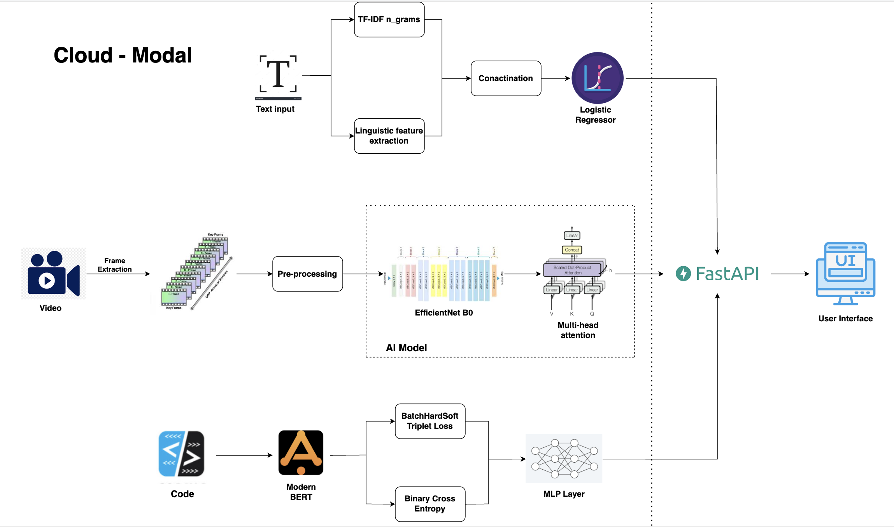

# GenReal - Deepfake Detection & AI Plagiarism Prevention

A cutting-edge web platform that provides AI-powered solutions for detecting deepfakes and preventing plagiarism. Built with modern web technologies to ensure digital integrity and content authenticity.

## Features

### Deepfake Detection
- **Real-time Video Analysis** - Instant detection of manipulated media
- **Detection Accuracy** - State-of-the-art AI algorithms
- **Multiple Format Support** - Works with various video and image formats
- **Batch Processing** - Handle multiple files simultaneously
- **API Integration Ready** - Easy integration with existing systems

### AI Plagiarism Prevention
- **AI Content Detection** - Identifies AI-generated text
- **Smart Plagiarism Analysis** - Advanced text comparison algorithms
- **Instant Detailed Reports** - Comprehensive analysis results
- **Multi-language Support** - Works across different languages
- **Citation Verification** - Ensures proper attribution

## Tech Stack

- **Frontend**: React 19.1.0, React Router DOM
- **Styling**: Tailwind CSS, Framer Motion for animations
- **3D Graphics**: Three.js, React Three Fiber, React Three Drei
- **Data Visualization**: D3.js, Deck.gl
- **Build Tool**: Vite
- **Development**: ESLint for code quality

## Workflow Diagram

## Features Overview

The platform offers two main services accessible through an intuitive web interface:

1. **Advanced Deepfake Detection** - Protects visual and audio content authenticity using state-of-the-art AI
2. **AI Plagiarism Prevention** - Ensures academic integrity with comprehensive content analysis

## Presentation [(Click Here)](https://drive.google.com/file/d/1xiDrqVjFpP-eDgx4-cW4ueU2E1StIW4Q/view?usp=sharing)

---

"In a world where seeing is no longer believing, GenReal makes digital trust real again."
